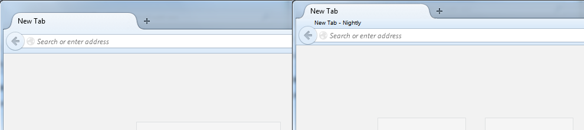
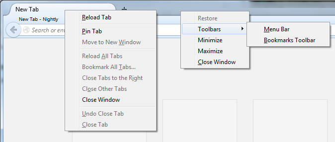

australismod
============

Restartless Firefox extension that modifies browsers with Australis in a few ways.

* reduced padding (including space above tab bar)
* reduced tab and tabbar height
* new slim title bar between tab bar and address bar
* maximize/restore by double clicking on tab
* Close Window option in tab context menu
* replaced tab bar's default toolbar context menu with Restore, Toolbars, Minimize, Maximize and Close Window options
* standard Restore/Move/Size/Minimize/Maximize/Close context menu on slim title bar
* move window by drag slim title bar
* resize tiles to preserve preferred number of newtab tiles

The reduced space above the tab bar might inconvenience moving a window,
but one can move the window by dragging the slim title bar.
The Drag-2-Move extension might further reduce the inconvenience.

## Screenshots

 
Side by side comparison without (left) and with (right) australismod.

 
The modified tab context menu and the new tab bar context menu.

## Recreating xpi package
1. pack bootstrap.js and install.rdf in a single zip file
2. rename zip file to end in .xpi extension
